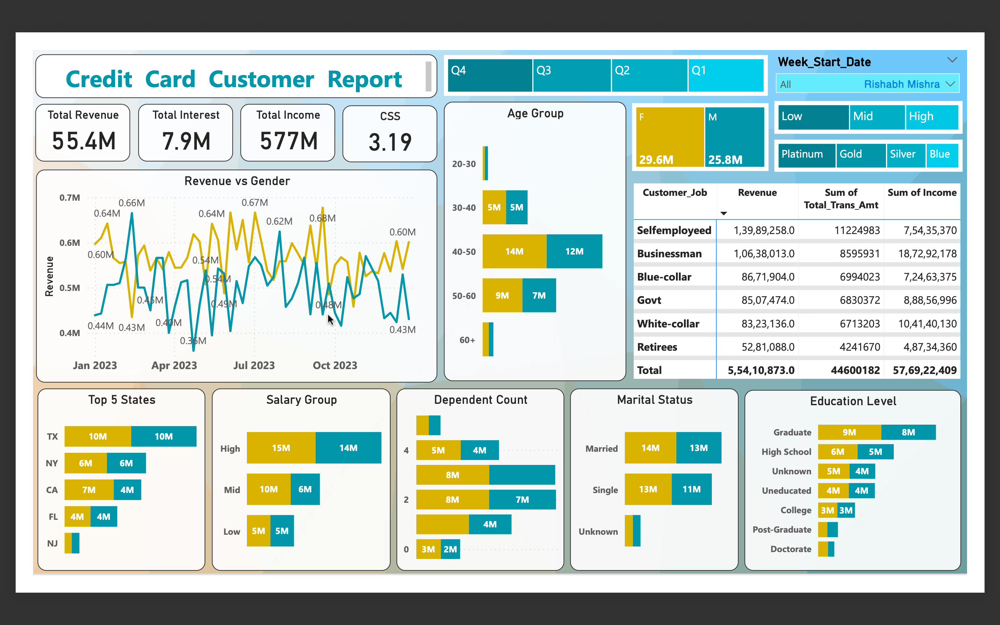
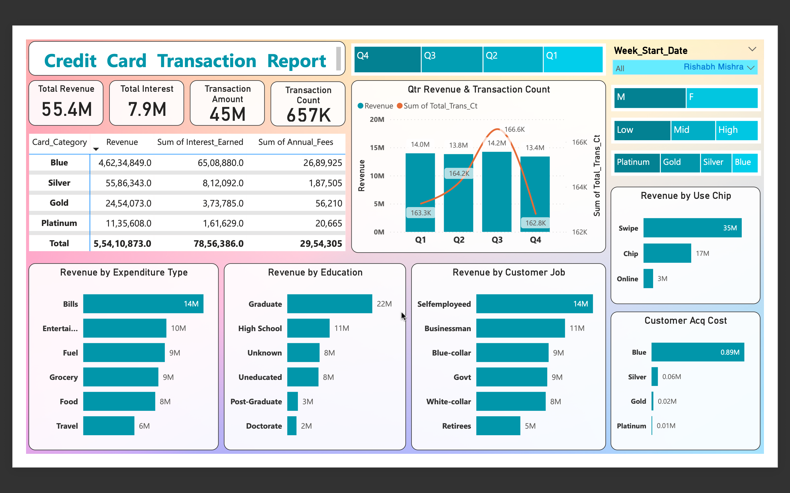

# Credit-Card-Financial-Analytics-End-to-End-Dashboard
 

## :clipboard: Executive Summary
### Overview
Credit card portfolios operate on thin margins driven by transaction volume, interest income, activation rates, and delinquency risk. Weekly monitoring is not optional — it’s operationally critical.
This project builds a structured analytics pipeline that transforms raw transaction and customer data into an executive-ready performance monitoring system. By integrating SQL-based data preparation with Power BI modeling and DAX-driven KPI logic, the dashboard enables stakeholders to track revenue drivers, customer segmentation, geographic concentration, and credit risk indicators in near real time.
Rather than presenting static visuals, this solution replicates how a financial operations team would monitor portfolio health on a weekly cadence.

## :bar_chart: Key Insights & Business Impact (Week 53 – Dec 31)
### Week-over-Week Performance
* Revenue increased by 28.8% WoW
  * Suggests strong seasonal transaction uplift (likely year-end spending effect)
  * Requires validation against interest income vs transaction volume growth
### Year-to-Date Overview
* Total Revenue: 57M
* Total Transaction Amount: 46M
* Total Interest Earned: 8M
* Activation Rate: 57.5%
* Delinquency Rate: 6.06%
### Portfolio Observations
#### Gender Revenue Contribution:
* Male: 31M
* Female: 26M
   → Revenue skew suggests different spending behavior or credit limits
#### Product Concentration Risk:
* Blue & Silver cards account for 93% of total transactions
 → Heavy dependence on limited card tiers; premium penetration opportunity?
#### Geographic Concentration:
* TX, NY, CA contribute 68% of revenue
  → High state-level exposure; potential regional risk concentration
#### Risk & Engagement:
* 57.5% activation rate indicates nearly half of issued cards are inactive
* 6.06% delinquency rate — requires benchmarking against industry standards

### DASHBOARDS 
 

 

 

## :hammer_and_wrench: Tech Stack & Skills
### Skills Demonstrated
* <ins>SQL-based data ingestion & structuring</ins> – Designed relational tables and imported structured transaction datasets
* <ins>KPI engineering in DAX</ins> – Built revenue logic, WoW comparisons, and segmentation measures
* <ins>Financial metric modeling</ins> – Combined fees, transaction amounts, and interest into unified revenue definitions
* <ins>Operational performance monitoring</ins> – Designed weekly tracking logic using time intelligence functions
* <ins>Risk indicator tracking</ins> – Incorporated activation and delinquency metrics into executive view

### Technology Stack
* Data Layer
  * SQL Database
  * Table creation
  * CSV ingestion
  * Structured transaction & customer tables
* Analytics & Visualization
  * Power BI
  * DAX Measures
  * Data modeling
  * Interactive dashboards
 
##  :dart: Project Context
### Business Problem

Credit card businesses must balance three competing forces:
1. Revenue growth (transactions + interest)
2. Customer engagement (activation & usage)
3. Credit risk control (delinquencies)
 

Fragmented reporting often makes it difficult to understand:
* Whether revenue growth is transaction-driven or interest-driven
* Which customer segments drive profitability
* Whether delinquency trends are emerging
* Which geographies or products dominate portfolio exposure
 
This project builds a centralized weekly monitoring dashboard to address those gaps.

## :gear: Technical Execution
### STEP 1 – SQL Data Preparation

#### Process
1. CSV file preparation
2. Table creation in SQL
3. Data import into structured schema

#### Design Decisions
* Separate customer and transaction tables
* Structured weekly date column for time-based aggregation
* Defined revenue components at row level before BI aggregation

### STEP 2 – Data Modeling in Power BI
#### Derived Segments
##### Age Group Segmentation

<code>
AgeGroup = SWITCH(
 TRUE(),
 customer_age < 30, "20-30",
 customer_age < 40, "30-40",
 customer_age < 50, "40-50",
 customer_age < 60, "50-60",
 "60+"
) </code> 

##### Income Group Segmentation
<code>
IncomeGroup =
SWITCH(
 TRUE(),
 income < 35000, "Low",
 income < 70000, "Med",
 "High"
) </code>

These enable behavioral and profitability comparisons across demographic tiers.

### STEP 3 – KPI Engineering (DAX)
#### Revenue Definition
Revenue =
Annual Fees + Total Transaction Amount + Interest Earned  
This unified revenue metric prevents siloed reporting across financial components.
#### Weekly Performance Logic
* Current Week Revenue
* Previous Week Revenue
* Week-over-Week Change %  

Time-intelligence logic allows operational teams to monitor momentum, not just static totals.

### STEP 4 – Dashboard Design
#### Executive Overview
* Total Revenue
* Total Interest
* Total Transaction Volume
* Activation Rate
* Delinquency Rate
#### Analytical Breakdowns
* Revenue by Gender
* Revenue by Income & Age Group
* Revenue by State
* Revenue by Card Category
* Weekly trend tracking

Fully interactive with slicers and drill-down capabilities for stakeholder exploration.

## :book: Operational Implications
### Revenue Structure
With 46M from transactions and 8M from interest, the portfolio appears volume-driven rather than finance-charge-driven. If delinquency increases, interest income may temporarily rise — but long-term credit losses could offset gains.
### Concentration Risk
93% transaction contribution from two card categories signals product concentration risk. Diversification strategy could stabilize long-term margins.
### Geographic Exposure
68% contribution from three states indicates regional dependence. Economic shocks in those states could materially impact revenue.
### Activation Opportunity
42.5% inactive accounts represent unrealized revenue potential. Targeted activation campaigns could materially improve portfolio yield without customer acquisition cost.

## :file_folder: Dataset
* Customer demographic dataset
* Transaction-level dataset
* Weekly time dimension
* Revenue components: annual fees, transactions, interest
  
## :dart: Target Audience
This methodology applies to:
* Retail banking analytics teams
* Credit card portfolio managers
* Risk & compliance teams
* Financial operations leadership

 
